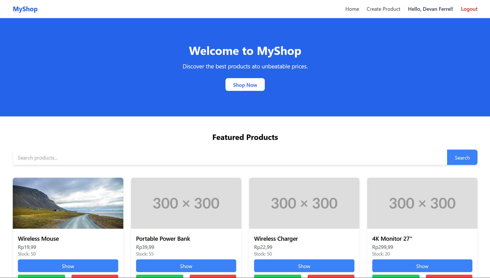

<div align=""> 
    <h1>MyShop</h1>
    <h3>A simple ASP.NET Core MVC Application</h3>
</div>

## 📂 Project Structure

```txt
Marketplace/  
├── Controllers/  
├── Infra/  
│   ├── Configuration/
│   ├── Database/
│   ├── Exceptions/
│   └── Server/  
├── Migrations/  
├── Models/  
├── Packages/  
│   ├── Auth/  
│   ├── HostedServices/  
│   └── Uploader/
├── Properties/
├── Repositories/  
├── Scripts/  
├── ViewModel/  
├── Views/  
│   ├── Shared/  
│   ├── Home/  
│   ├── Product/  
│   ├── Auth/  
```

### 1. Controllers
Contains MVC Controllers that will handle incoming HTTP requests and return views or json responses

### 2. Infra
Contains application infra related components such as AppConfiguration, Database, Exceptions and Server

### 3. Migrations
Contains Entity Framework migrations files. Generated with `dotnet ef migrations add MigrationName`

### 4. Models
Contains classes representing the application data model or entities.

### 5. Packages
Contains modular components that can be reused such as Auth handling, Background Services and File Uploader.

### 6. Repositories
Contains repository classes that abstract database queries and it's implementation to follow the repository pattern.

### 7. Scripts
Contains javascript files that will be included in views

### 8. ViewModel
Contains ViewModel classes that will help transfer data between the View and Controller.

### 9. Views
Contains razor view files with ext `.cshtml` which define the UI application, layout and components.  


## 💻 Techstacks

